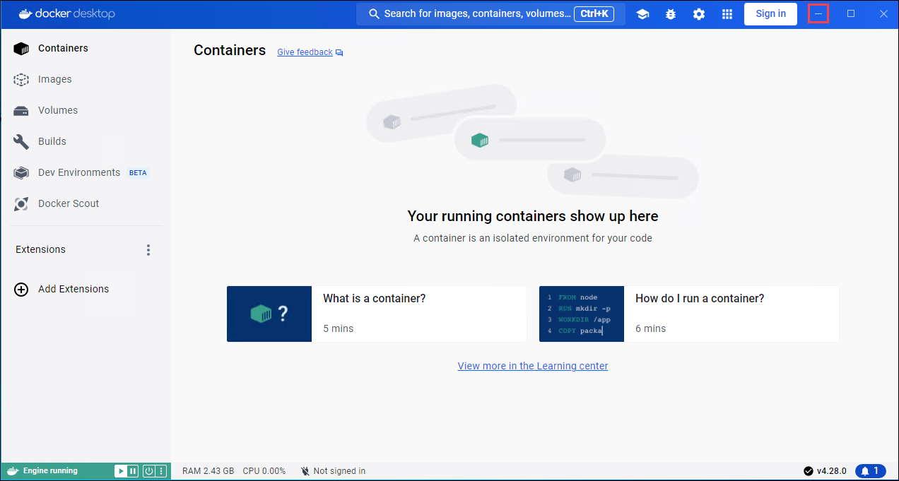
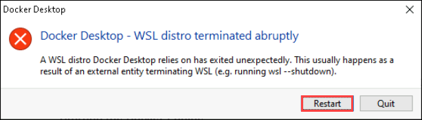
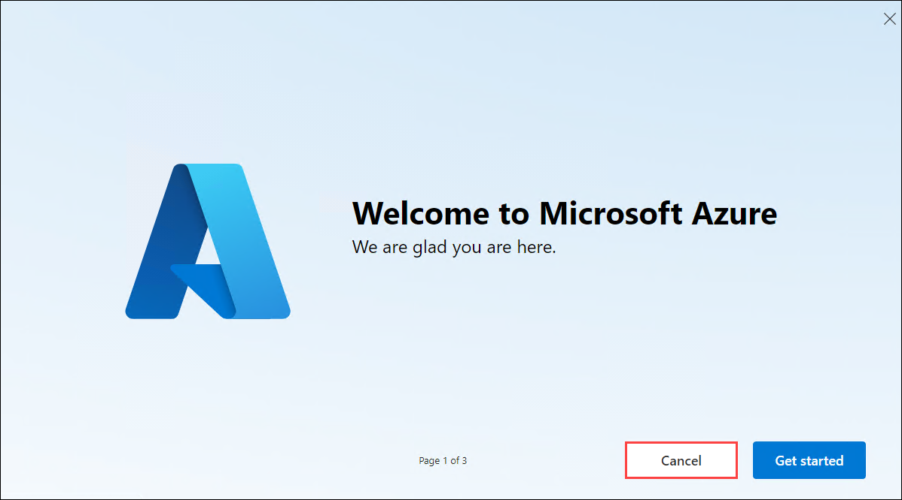
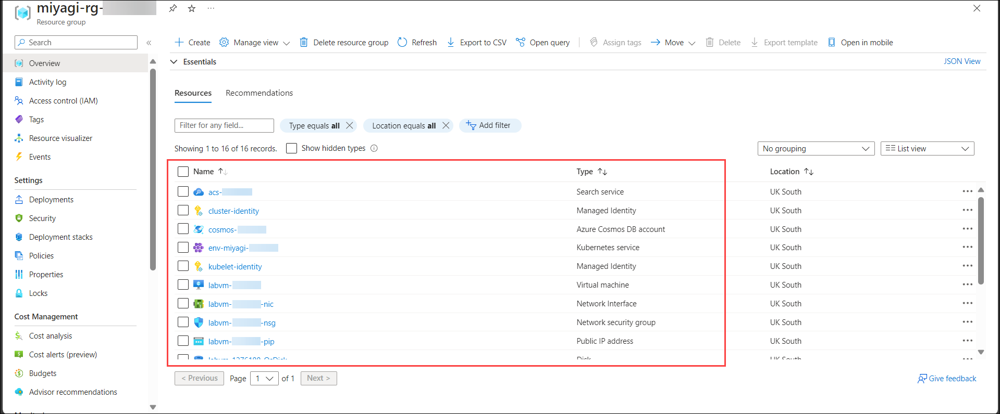

## Comenzando con el Laboratorio

1. Una vez configurado el entorno, su navegador cargará una máquina virtual (JumpVM), utilice esta máquina virtual durante todo el taller para realizar el laboratorio. Puede ver el número en la parte inferior de la guía de laboratorio para cambiar a diferentes ejercicios en la guía de laboratorio.

   
 
1. Para obtener los detalles del entorno del laboratorio, puede seleccionar la pestaña **Entorno**. Además, las credenciales también se enviarán por correo electrónico a su dirección de correo electrónico registrada. También puede abrir la Guía de Laboratorio en una ventana completa e independiente seleccionando **Dividir Ventana** en la esquina inferior derecha. Además, puede iniciar, detener y reiniciar máquinas virtuales desde la pestaña **Recursos**.

    
   
   > Verá el valor SUFFIX en la pestaña **Entorno**; úselo dondequiera que vea SUFFIX o DeploymentID en los pasos del laboratorio.
 
## Inicie sesión en el Portal de Azure

1. Minimice **Docker Desktop** haciendo clic en el botón **Minimizar**.

   

   - Si se encuentra con el problema "Una distribución WSL en la que se basa Docker Desktop se cerró inesperadamente", esto generalmente sucede como resultado de que una entidad externa finalizó WSL, haga clic en el botón **Reiniciar**

      

1. En JumpVM, haga clic en el acceso directo al Portal de Azure del navegador Microsoft Edge, el cual se ha creado en el escritorio.

   

1. En la pestaña **Iniciar sesión en Microsoft Azure**, verá la pantalla de inicio de sesión. Ingrese el siguiente correo electrónico o nombre de usuario y haga clic en **Siguiente**. 

   * **Correo electrónico/Nombre de usuario**: **<inject key="AzureAdUserEmail"></inject>**

     
     
1. Ahora ingrese la siguiente contraseña y haga clic en **Iniciar sesión**.
   
   * **Contraseña**: **<inject key="AzureAdUserPassword"></inject>**

     
   
1. Si ve la ventana emergente **¿Permanecer conectado?**, seleccione **No**.

   

1. Si aparece una ventana emergente **Bienvenido a Microsoft Azure**, seleccione **Cancelar** para omitir el recorrido.

    
   
1. Ahora verá el Panel del Portal de Azure, haga clic en **Grupos de recursos** en el panel Navegar para ver los grupos de recursos.

   

1. En **Grupos de Recursos**, haga clic en el grupo de recursos **miyagi-rg-<inject key="DeploymentID" enableCopy="false"/>**.

   

1. En el grupo de recursos **miyagi-rg-<inject key="DeploymentID" enableCopy="false"/>**, verifique los recursos presentes.

   

> [!IMPORTANTE] 
> **Para una experiencia más fluida durante la práctica de laboratorio, es importante revisar detenidamente tanto las instrucciones como las notas que las acompañan. Esto le ayudará a realizar las tareas con facilidad y confianza.**
