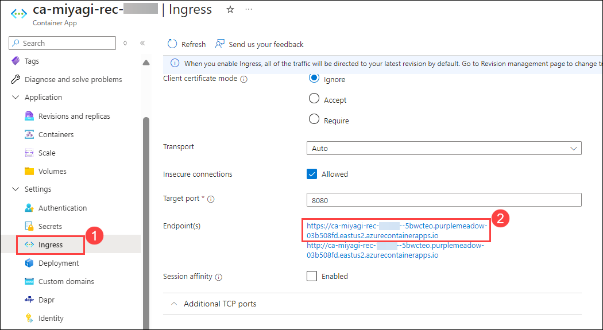

# Lab 2: Create Docker image for Recommendation Service and deploy to Azure Container Apps

In this lab, you'll be building the docker images and publishing them to Azure Container Apps.

### Task 1: Verify the deployed API Management service and create an API

1. Navigate back to the Azure portal, open the Resource Group named **miyagi-rg-<inject key="DeploymentID" enableCopy="false"/>**  and select **miyagi-apim-<inject key="DeploymentID" enableCopy="false"/>** API Management service from the resources list.

   

1. In the **API Management service** tab, from the left menu, click on **APIs** **(1)** and select **HTTP** **(2)** under Define a new API to create an HTTP API.

   

1. In the **Create an HTTP API** tab enter the following details and click on **Create** **(6)**
   
   | **Parameter**        | **Values**           | 
   | -------------------- | -------------------- | 
   | API Type **(1)**     | **Basic**            | 
   | Display name **(2)** | **miyagi-api**       |
   | Name **(3)**         | **miyagi-api**       |
   | Web service URL **(4)** | **<inject key="OpenAIEndpoint" enableCopy="true"/>**|
   | API URL suffix **(5)** | **miyagi** |

   

1. Once API is created, click on **Overview** **(1)** from the left-menu and copy the **Gateway URL** **(2)** of API Management service. Paste it into Notepad for later use.

   

### Task 2: Update the Docker Image for the Recommendation service

In this task, you will be updating the API Management Gateway URL as an endpoint in appsettings.json file of Recommendation Service.

1. Navigate to Visual Studio Code, open the `appsettings.json` file from the path `C:\LabFiles\miyagi\services\recommendation-service\dotnet\appsettings.json`.

   

1. In the `appsettings.json` file, you have to replace the **endpoint** value from **OpenAI resource endpoint** with **API Gateway URL** which you have copied in Task-1 Step-4.

   

1. From the Explorer, navigate to `Miyagi/services/recommendation-service/dotnet/` **(1)** path. Right-click on the `dotnet` folder and select **Open in Integrated Terminal** **(2)** from the options tab to open the terminal with the required path.

   

### Task 3: Build Docker Images for the Recommendation service

1. Open the **Docker** Application from the Lab VM desktop by double-clicking on it.

   
   
1. In the **Docker Subscription Service Agreement** window, click **Accept**.

   

1. In the **Welcome to Docker Desktop** window, click on **Continue without signing in**.

1. Navigate back to **Visual studio code** window and navigate to **miyagi/services/recommendation-service/dotnet** right - click on dotnet in cascading menu, select **Open in integrate Terminal**

1. Run the following command to build a **Docker image**

   ```
   docker build . -t miyagi-recommendation      
   ```

   

   **Note**: Please wait as this command may require some time to complete.

1. Run the following command to get the newly created image.

   ```
   docker images
   ```
   
   

1. Navigate back to **Docker desktop**, from the left pane select **Images**.

   

1. In the **Images** blade, notice **miyagi-recommendation(1)** image is created, select **run(2)** icon .

   

1. In the **Run a new container** window select the dropdown arrow.

   .png)

1. In the **Run a new containe**, under **Ports** for **Host Port** enter **5224** and click on **Run**.

    

1. Click on **5224:80** URL link

   
   
1. You should be able to see the application running locally
   
   


### Task 4: Push the Docker Image of Recommendation service to ACR

In this task, you'll Push miyagi-recommendation images to acr. 

1. Navigate back to the **Visual studio code** window and navigate to **miyagi/services/recommendation-service/dotnet** right - click on dotnet in cascading menu, select **Open in intergate Terminal**

1. Run the following command to log in to the **Azure portal**.

    ```
    az login
    ```

1. This will redirect to **Microsoft login page**, select your Azure account **<inject key="AzureAdUserEmail"></inject>**, and navigate back to the **Visual studio code**.

   

1. Run the following command to log in to an **Azure Container Registry (ACR)** using the Azure CLI.

   > **Note**: Please replace **[ACRname]** with **<inject key="AcrLoginServer" enableCopy="true"/>**, **[uname]** with **<inject key="AcrUsername" enableCopy="true"/>**, and **[password]** with **<inject key="AcrPassword" enableCopy="true"/>**.
   
   ```
   az acr login -n [ACRname] -u [uname] -p [password]
   ```

   
    
1. Run the following command to add the tag.

   > **Note**: Please replace **[ACRname]** with **<inject key="AcrLoginServer" enableCopy="true"/>**.

   ```
   docker tag miyagi-recommendation:latest [ACRname]/miyagi-recommendation:latest
   ```

1. Run the following command to push the image to the container registry.

   > **Note**: Please replace **[ACRname]** with **<inject key="AcrLoginServer" enableCopy="true"/>**.

   ```
   docker push [ACRname]/miyagi-recommendation:latest
   ```

   

### Task 5: Create a container app for miyagi-recommendation.

In this task, you'll will be creating a container app for the recommendation.

1. Run the following command to create **Container App environment**.

   > **Note**: Please replace **[DID]** with **<inject key="DeploymentID" enableCopy="true"/>** and **[Region]** with **<inject key="Region" enableCopy="true"/>**.

   ```
   az containerapp env create --name env-miyagi-[DID] --resource-group miyagi-rg-[DID] --location [Region]
   ```

1. Run the following command to create **Container App**.

   > **Note**: Please replace **[DID]** with **<inject key="DeploymentID" enableCopy="true"/>**, **[ACRname]** with **<inject key="AcrLoginServer" enableCopy="true"/>**, **[uname]** with **<inject key="AcrUsername" enableCopy="true"/>**, and **[password]** with **<inject key="AcrPassword" enableCopy="true"/>**.

   ```
   az containerapp create --name ca-miyagi-rec-[DID] --resource-group miyagi-rg-[DID] --image [ACRname]/miyagi-recommendation:latest --environment env-miyagi-[DID] --registry-server [ACRname] --registry-username [uname] --registry-password [password]
   ```

1. Run the following command to enable **Container App ingress**.

   > **Note**: Please replace **[DID]** with **<inject key="DeploymentID" enableCopy="true"/>**
   
   ```
   az containerapp ingress enable -n ca-miyagi-rec-[DID] -g miyagi-rg-[DID] --type external --allow-insecure --target-port 80
   ```
 
### Task 6: Update Container App Recommendation service URL for miyagi-ui 

1. In the Azure Portal page, in the Search resources, services, and docs (G+/) box at the top of the portal, enter **Container Apps (1)**, and then select **Container Apps (2)** under services.

   

1. In the **Container Apps** blade, select **ca-miyagi-rec-<inject key="DeploymentID" enableCopy="false"/>**.

   

1. In the **ca-miyagi-rec-<inject key="DeploymentID" enableCopy="false"/>** page, from left navigation pane select **Ingress** **(1)** under setting session and copy **Endpoints** **(2)** URL link.

   

1. Navigate back to **Visual Studio Code**, navigate to **miyagi>ui>typescript>.env.** and replace existing code for **RECCOMMENDATION_SERVICE_URL** with copied for **Endpoints** and save the file 

   

1. Right-click on **ui/typescript** in cascading menu, select **Open in intergate Terminal**.

1. Run the following command to log in.

   > **Note**: Please replace **[ACRname]** with **<inject key="AcrLoginServer" enableCopy="true"/>**, **[uname]** with **<inject key="AcrUsername" enableCopy="true"/>**, and **[password]** with **<inject key="AcrPassword" enableCopy="true"/>**.

    ```
    docker login [ACRname] -u [uname] -p [password]
    ```
   
1. Run the following command to push the image to the container registry

   > **Note**: Please replace **[ACRname]** with **<inject key="AcrLoginServer" enableCopy="true"/>**.

   ```
   docker push [ACRname]/miyagi-recommendation:latest
   ```

1. Reture to **Azure Portal** in Search resources, services and docs (G+/) box at the top of the portal, enter **Container Apps**, and then select **Container Apps** under services.

1. In the **Container Apps** blade, select **ca-miyagi-ui-<inject key="DeploymentID" enableCopy="false"/>**.

   

1. In the **ca-miyagi-ui-<inject key="DeploymentID" enableCopy="false"/>**, from left navigation pane select **Ingress** and click on **Endpoints** URL link.

   

1. You should get miyagi app running locally as depicted in the image below.

   

1. Navigate back to the **ca-miyagi-ui-<inject key="DeploymentID" enableCopy="false"/>** page, under **Application** select **Revisions** and click on **miyagi-ui-ca-<inject key="DeploymentID" enableCopy="false"/>**, on **Revision details** window, select **Refresh**.

   

1. When **Are you sure you want to restart the revision?** prompt on **Restart revision** window clcik on **Continue**.

   

1. Once restarting is done for **ca-miyagi-ui-<inject key="DeploymentID" enableCopy="false"/>** from left pane select **Ingress** and click on **Endpoints**.

   

1. You should get miyagi app running locally as depicted in the image below.

   
