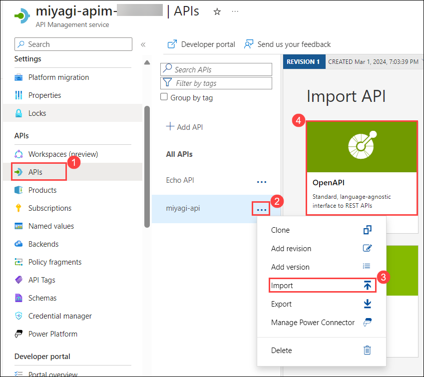
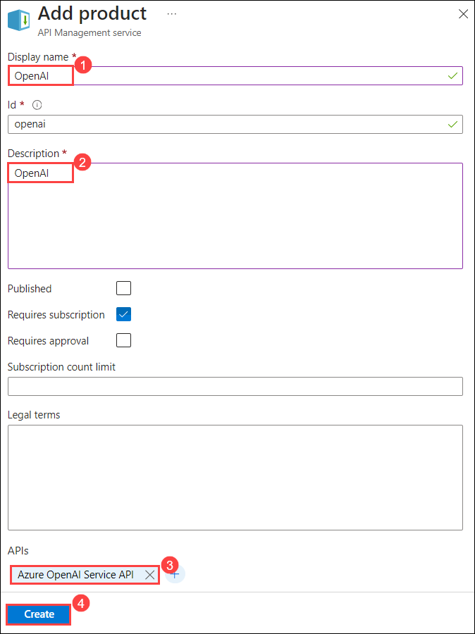
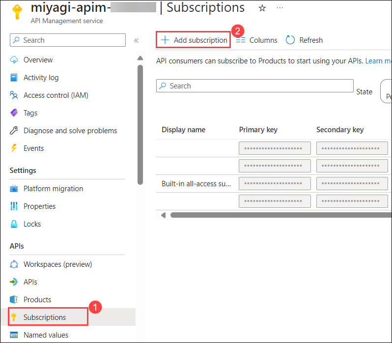
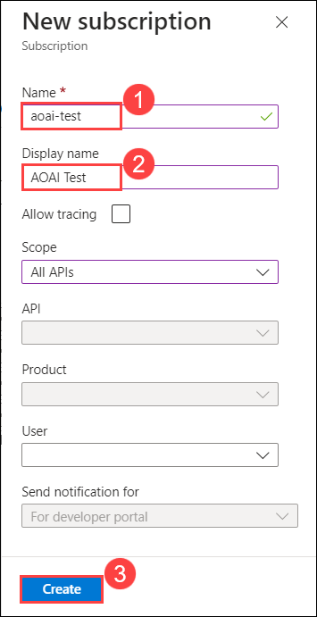
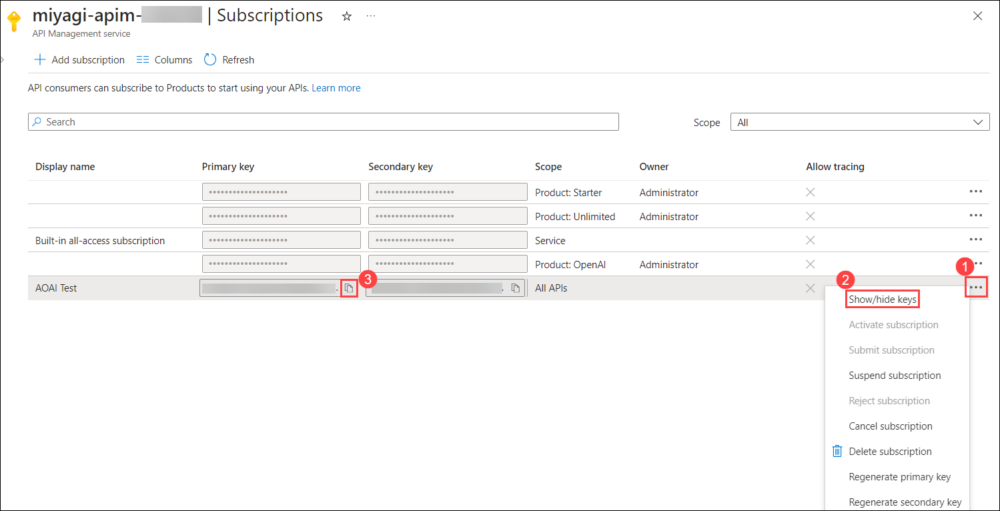
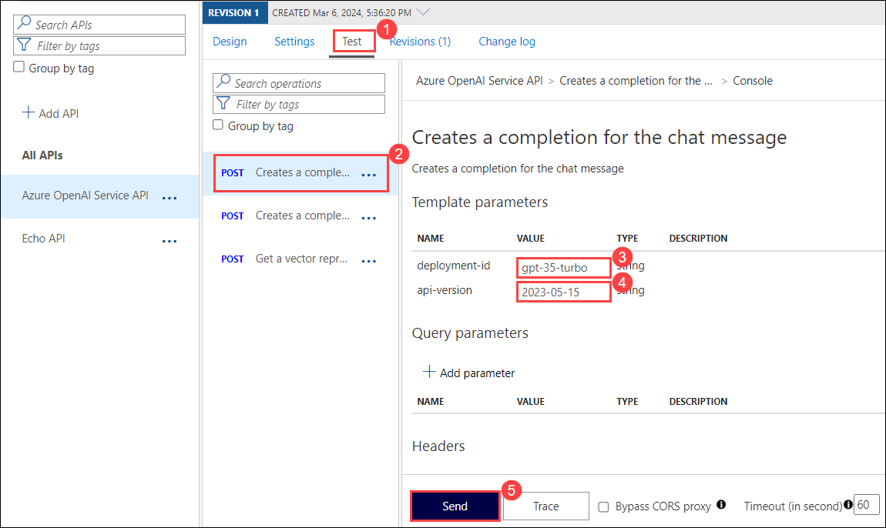
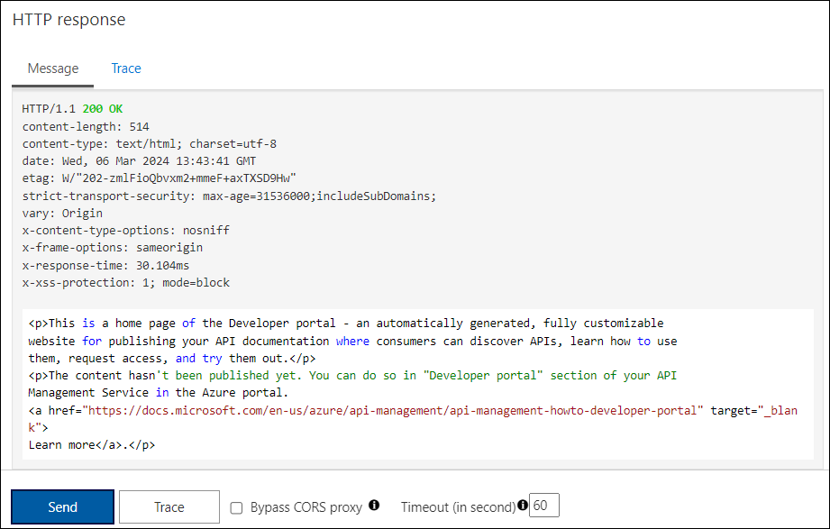

# Lab 3 - Expose Open AI through APIM

In this lab, you'll be verifying and creating APIs in the deployed API Management service to updating the Docker image for the Recommendation service. The revision of the Recommendation service from the Container App encapsulates the meticulous approach to maintaining and optimizing containerized applications within the project's scope.

### Task 1: Verify the deployed API Management service and create an API

1. Navigate to Azure portal, open the Resource Group named **miyagi-rg-<inject key="DeploymentID" enableCopy="false"/>**  and select **miyagi-apim-<inject key="DeploymentID" enableCopy="false"/>** API Management service from the resources list.

   

1. From the left-menu, click on **APIs** **(1)** and select **HTTP** **(2)** under Define a new API to create an HTTP API.

   

1. Enter the following values in the Create an HTTP API pane:
   
   | **Parameter**        | **Values**           | 
   | -------------------- | -------------------- | 
   | API Type **(1)**     | **Basic**            | 
   | Display name **(2)** | **miyagi-api**       |
   | Name **(3)**         | **miyagi-api**       |
   | Web service URL **(4)** | Enter the Endpoint of OpenAI End point  **<inject key="OpenAIEndpoint" enableCopy="true"/>**  |
   | API URL suffix **(5)** | **miyagi** |
   | Click on  **(6)** | **Create** |

   

1. Once API is created, click on **Overview** **(1)** from the left-menu and copy the **Gateway URL** **(2)** of API Management service. Paste it into Notepad for later use.

   

### Task 2: Create API Management Policy and Roles

1. Inside API Management select **APIs** **(1)**, click on the **three dots** **(2)** next to miyagi-api, select **Import** **(3)** and click on **OpenAPI** **(4)**.

   

2. Once the popup shows paste the below link into the **textbox** **(1)**, select update, and then click **import** **(2)**. 

   ```
   https://raw.githubusercontent.com/Azure/azure-rest-api-specs/main/specification/cognitiveservices/data-plane/AzureOpenAI/inference/stable/2023-05-15/inference.json
   ```

   

3. You should now see a series of APIs under the Azure OpenAI Service API.
   
    

4. Navigate to the **settings** tab and update the subscription key **Header Name** to **api-key** and click on **Save**.

   

5. In the **miyagi-apim-<inject key="DeploymentID" enableCopy="false"/>** API Management service, click on **Products** **(1)** under APIs from the left menu and click on **+ Add** **(2)**.

   

6. In the **Add product** display name as **OpenAi** **(1)**, description as **OpenAI** **(2)**. Under the APIs menu click the **plus sign** add the **Azure OpenAI Service API** **(3)** hit Enter and click on **Create** **(4)**.

   

7. In the **miyagi-apim-<inject key="DeploymentID" enableCopy="false"/>** API Management service, click on **subscriptions** **(1)** under APIs from the left menu and click on **+ Add subscription** **(2)**.

   

8. In the **Add subscription**, enter the Name as **aoai-test** **(1)**, enter Display name as **AOAI Test** **(2)**, and click on **Create** **(3)**.

   

8. Once the subscription is created click the **three dots** **(1)** next to the newly created key and then click **Show\hide keys** **(2)**. Copy the **primary subscription** **(3)** key and save it for later.

   

9. Navigate to your OpenAI resource in the Azure Portal and select the Identity and Access Management tab. Select Add and role-assignment and at the next screen select Cognitive Services User, click next, then the managed identity radio button, and select memebers. In the managed identity drop down you should see your API Management, select the manage identity and click select. Once finished select Review and Assign and save the role assignment.

    

10. In the Azure Portal navigate back to the API Management resource and select APIs. Select the Azure OpenAI Service API create in the earlier step and select All Operations. Copy the below policy to overwrite the **inbound** tags only.

   ```
   <inbound>
      <base />
      <set-header name="api-key" exists-action="delete" />
      <authentication-managed-identity resource="https://cognitiveservices.azure.com" output-token-variable-name="msi-access-token" ignore-error="false" />
      <set-header name="Authorization" exists-action="override">
         <value>@("Bearer " + (string)context.Variables["msi-access-token"])</value>
      </set-header>
      <set-backend-service base-url="https://<<API_MANAGMENT_URL>>/openai" />
   </inbound>
   ```

11. Next navigate to the test tab in API Management next to settings and select **Creates a completion for the chat message**. In the deployment-id filed enter **gpt-35-turbo**. Inside the api-version field enter **2023-05-15** and click send. 

   

12. Scroll down the response and you should see a 200 response and a message back from your OpenAI service.

    


### Task 2: Update the Docker Image for Recommendation service

1. Navigate to Visual Studio Code, open the `appsettings.json` file from the path `C:\LabFiles\miyagi\services\recommendation-service\dotnet\appsettings.json`.

   

1. In the `appsettings.json` file, you have to replace the **endpoint** value from **OpenAI resource endpoint** to **API Gateway URL** which you have copied in Task-1 Step-4.

   

1. From the Explorer, navigate to `Miyagi/services/recommendation-service/dotnet/` **(1)** path. Right-click on `dotnet` folder and select **Open in Integrated Terminal** **(2)** from the options tab to open terminal with required path.

   

1. Now, you need to re-build the docker image for recommendation service by running the below docker command. Make to update the docker image name which was created earlier for recommendation service with the same name.

   ```
   docker build . -t [Docker_Image_Name_Recommendation_Service]
   ```

   

1. Run following command to ACR login.

   > **Note**: Please replace **[ACRname]** with **<inject key="AcrLoginServer" enableCopy="true"/>**, **[uname]** with **<inject key="AcrUsername" enableCopy="true"/>**, and **[password]** with **<inject key="AcrPassword" enableCopy="true"/>**.

    ```
    docker login [ACRname] -u [uname] -p [password]
    ```

1. Once you are logged into ACR. Run the below command to push the updated docker image of the recommendation service to the container registry.

   **Note**: Make sure to replace **[ACRname]** with **<inject key="AcrLoginServer" enableCopy="true"/>**.

   ```
   docker push [ACRname]/miyagi-recommendation:latest
   ```

   

### Task 3: Revision of Recommendation service from Container App

1. Navigate to Azure portal, open the Resource Group named **miyagi-rg-<inject key="DeploymentID" enableCopy="false"/>**  and select **miyagi-rec-ca-<inject key="DeploymentID" enableCopy="false"/>** Container App from the resources list.

   

1. In the **ca-miyagi-rec-<inject key="DeploymentID" enableCopy="false"/>** Container App pane, select **Revisions** **(1)** under Applications from left-menu and then open the **Active Revision** named **ca-miyagi-rec-<inject key="DeploymentID" enableCopy="false"/>** **(2)**.

   

1. You will see the **Revision details** pop-up in the right-side, click on **Restart**. You will see a pop-up to restart the revision, click on **Continue** to confirm.

   

   

1. You will see the notification once the Revision is restarted successfully.

   

1. Select **Ingress** **(1)** under Settings from the left menu and then scroll down to Endpoints of Container App i.e, **ca-miyagi-rec-<inject key="DeploymentID" enableCopy="false"/>-SUFFIX** **(2)**. Click on the secured link to open it.

   

1. You can see the swagger page for the recommendation service as shown in the below image:

   
