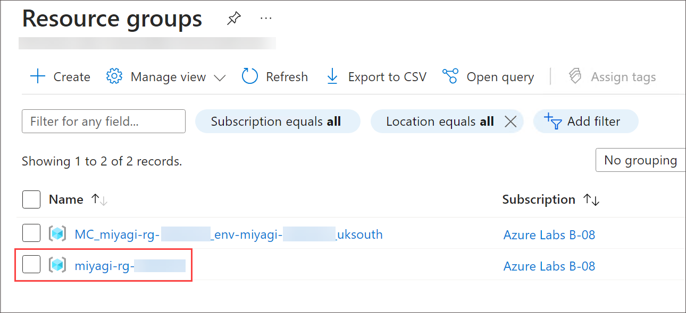
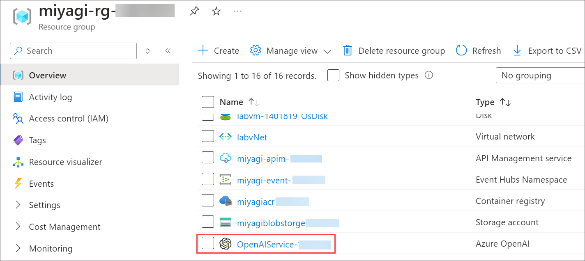
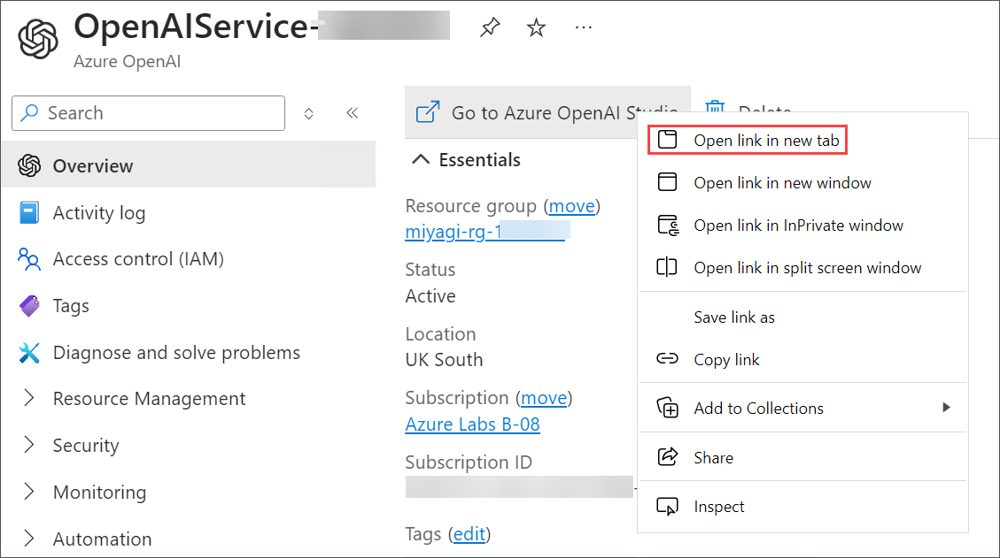
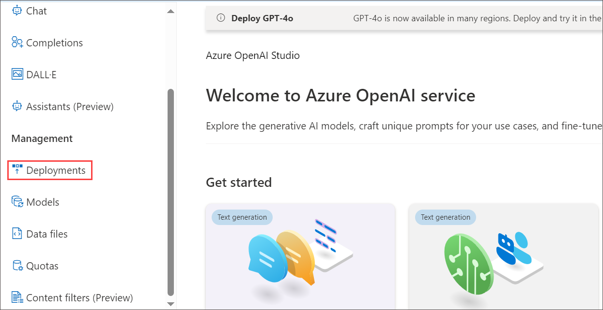
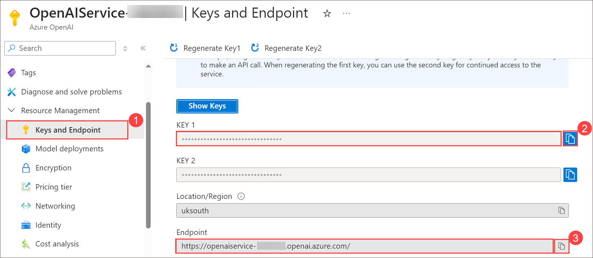
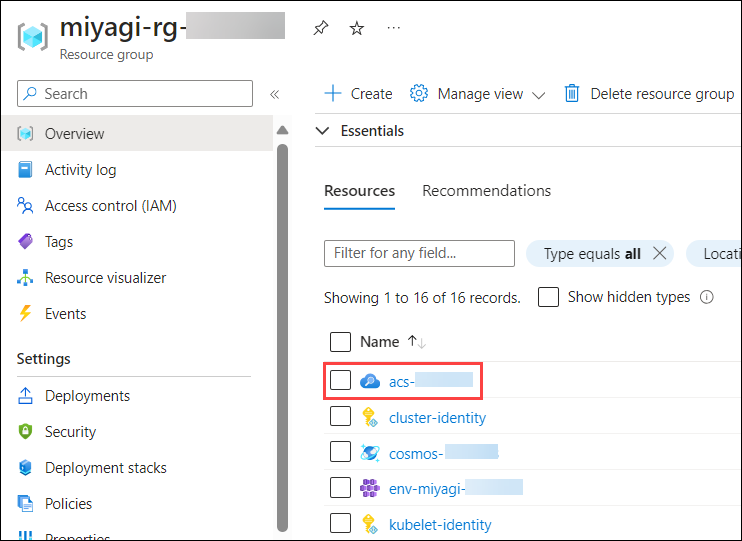
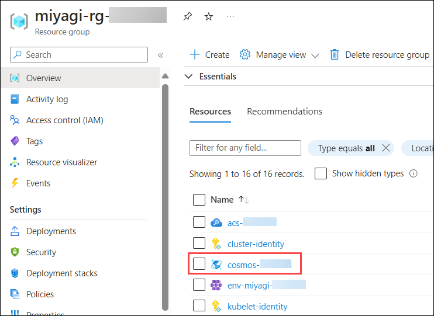
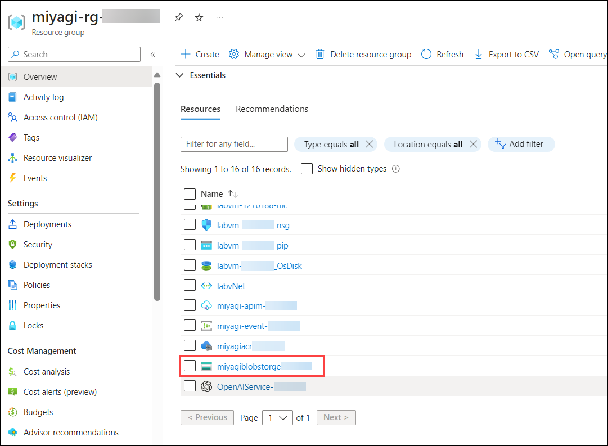

# Lab 1: Verify and Retrieve the values of Azure Resources (optional)

In this lab, you will verify and retrieve specific values such as Endpoint, Connection String, and Key for various Azure resources. This is crucial for ensuring the proper configuration and connectivity of these resources.

   - Azure OpenAI : **OpenAIService-<inject key="DeploymentID" enableCopy="false"/>** 
   - Azure Cosmos DB account : **cosmos-<inject key="DeploymentID" enableCopy="false"/>**
   - Search Service : **acs-<inject key="DeploymentID" enableCopy="false"/>**

1. To verify the deployment model names for "**deploymentOrModelId**" and "**embeddingDeploymentOrModelId**" follow the below steps:
   
      - On the Azure Portal home page, click on **Resource groups** in the **Navigate** panel.

      - From the Resource groups page, click on **miyagi-rg-<inject key="DeploymentID" enableCopy="false"/>**.

         

      - In the **miyagi-rg-<inject key="DeploymentID" enableCopy="false"/>**, from the Overview (1) tab select the **OpenAIService-<inject key="DeploymentID" enableCopy="false"/> (2)**.

        

      - In the **OpenAI Overview** **(1)** page, right-click on **Go to Azure OpenAI Studio** and click on **Open link a new tab**.

         
   
      - In the **Azure AI Studio**, from the left navigation pane under the **Management** section, select **Deployments**.

           
        
      - In the **Deployments** blade of Azure AI Studio, click on **gpt-4** model name **(1)** and verify the **deployment name** of gpt-4 model **(2)**.

          .png)
        
          .png)
      
      -  Navigate back to the **Deployment** page.

      - In the Deployments blade of Azure AI Studio, click on **text-embedding-ada-002 model name (1)** and verify the **deployment name** of **text-embedding-ada-002 model(2)**.
        
         .png)

         .png)

1. To verify the values for **endpoint** and **apiKey** follow the below steps:

   -  Navigate back to the tab displaying **Azure portal**. 

   -  In the **OpenAIService-<inject key="DeploymentID" enableCopy="false"/>** blade under **Resource Management** section, select **Keys and Endpoint**, verify the **KEY1** and **Endpoint**.
     
      

1. To verify the values for  "azureCognitiveSearchEndpoint", "azureCognitiveSearchApiKey", follow below steps:
   
   - Navigate back to **miyagi-rg-<inject key="DeploymentID" enableCopy="false"/>** resource group.

   - On the **miyagi-rg-<inject key="DeploymentID" enableCopy="false"/>** page, select **acs-<inject key="DeploymentID" enableCopy="false"/>** from resources list.

      
 
   - On **acs-<inject key="DeploymentID" enableCopy="false"/>** blade, verify the **URL**.
   
      

   - On **acs-<inject key="DeploymentID" enableCopy="false"/>** blade, under **Settings** section, verify the **Primary admin Key** value.
   
      

1. To verify the values for "**cosmosDbUri**" and "**cosmosDbName**," please follow the steps below:

   - Navigative back to resource group **miyagi-rg-<inject key="DeploymentID" enableCopy="false"/>** resource group page, select **cosmos-<inject key="DeploymentID" enableCopy="false"/>** from resources list.

     

   - On **cosmos-<inject key="DeploymentID" enableCopy="false"/>** verify the **URL**.
     
     

   - On **cosmos-<inject key="DeploymentID" enableCopy="false"/>** under **Settings**, select **Keys** and verify the value of the **Cosmos DB Primary Connection String**.

     

1. To obtain the values for  "**blobServiceUri**", please follow the steps below:

   - Navigative back to resource group **miyagi-rg-<inject key="DeploymentID" enableCopy="false"/>** resource group page, select **miyagiblobstorge<inject key="DeploymentID" enableCopy="false"/>** from resources list.

     

   - In the **miyagiblobstorge<inject key="DeploymentID" enableCopy="false"/>** storage account from the left menu select **Endpoints** **(1)** under Settings verify the **Blob service** **(1)** under Blob service.

     

1. Now, click on **Next** from the lower right corner to move to the next page.
