# Lab 1: Bringing your own data with Azure AI Search

### Duration: 120 minutes

In this lab, you'll run Chat Copilot locally after retrieving Azure OpenAI Service values from the Azure portal. By cloning the Chat-Copilot GitHub repo and setting up dependencies, you'll configure and execute the application. Uploading documents enables interaction with Copilot, which generates responses based on their content, complete with citations for validation. This exercise provides hands-on experience in utilizing Chat Copilot with your own data, managing documents and sessions within the application.
 
# Exercise 1: Run the Chat Copilot App Locally

### Task 1: Retrieving the Azure OpenAI Service values

From the Azure portal, you need to retrieve the Azure OpenAI Service Key, Endpoint, and LLM model names.

1. In the Azure Portal, search for **Azure OpenAI** and select it.
   
    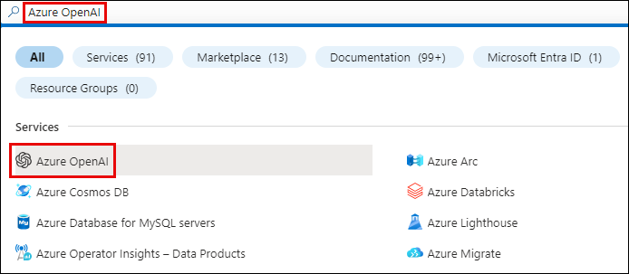

2. Select the Azure OpenAI resource created and click on **Keys and Endpoints** from the left pane.
   
    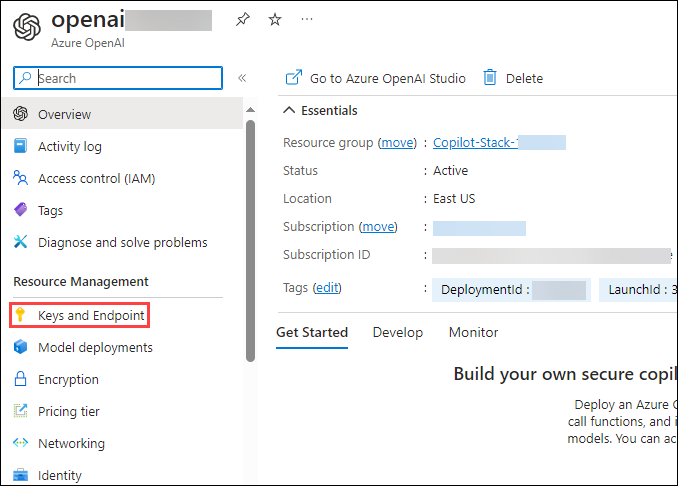

3. Copy the Keys and the Endpoint and store them in Notepad.
   
    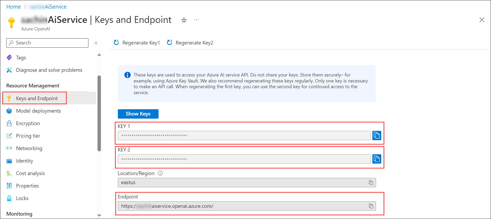

4. From the Overview page, click on **Go to Azure OpenAI Studio**.
   
    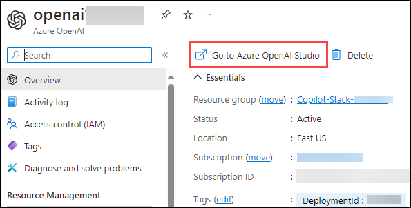

5. Navigate to **Deployments** in the left navigation pane, copy the deployment names of your AI model and store them in Notepad.
    
    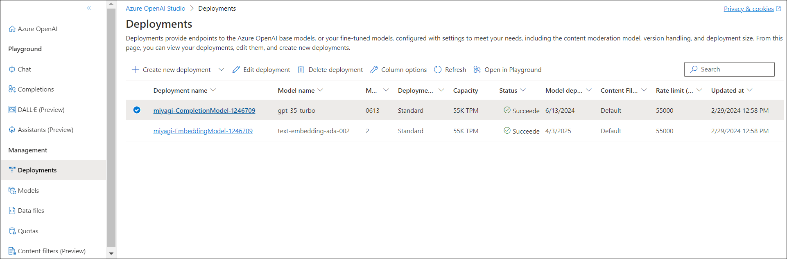

### Task 2: Cloning the Chat-Copilot GitHub Repo

You will clone the Chat-Copilot GitHub Repository to the environment where you're working on this lab, follow these steps to do so.

1. Open PowerShell as an administrator.
   
1. Navigate to the directory `C:/Users/demouser` by running the below command.
 
   ``` 
   cd C:/Users/demouser
   ```
1. Run the command to clone the GitHub repository.
   
   ``` 
   git clone https://github.com/CloudLabsAI-Azure/chat-copilot CHAT-COPILOT
   ```
1. Open Visual Studio Code and click on `File> Open folder`.

   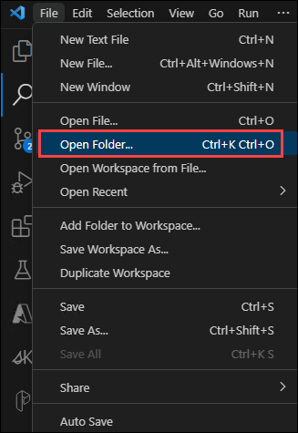

1. Select **CHAT-COPILOT** and review the files.

   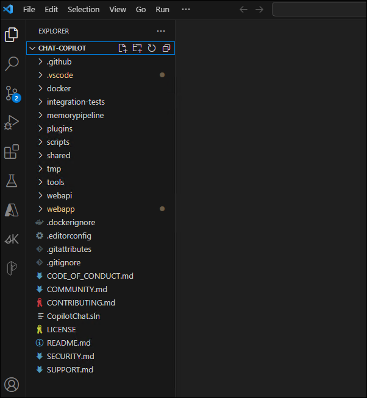

### Task 3: Setting up the Environment

1. Open PowerShell as an administrator on your local machine. You need to have PowerShell Core 6+ installed, which is different from the default PowerShell installed on Windows.

2. Setup your environment by navigating to the scripts directory of chat-copilot using the command:

   ``` 
   cd C:\Users\demouser\chat-copilot\scripts\
   ```

3. Run the below command to install Chocolatey, dotnet-7.0-sdk, nodejs, and yarn:

   ```
   .\Install.ps1
   ```

   >**Note:** If you receive an error that the script is not digitally signed or cannot execute on the system, you may need to change the execution policy or unblock the script.

### Task 4: Configure and run the Chat Copilot App locally

1. Configure Chat Copilot by running the following command. You can use the Azure OpenAI Service Name, Key, Endpoint, and the already deployed model names that you noted down in the previous steps or use the values from the below mentioned table.
   
   ```
   .\Configure.ps1 -AIService {AI_SERVICE} -APIKey {API_KEY} -Endpoint {AZURE_OPENAI_ENDPOINT} -CompletionModel {DEPLOYMENT_NAME} -EmbeddingModel {DEPLOYMENT_NAME} -PlannerModel {DEPLOYMENT_NAME}
   ```
   | **Variables**                          | **Values**                                            |
   | ---------------------------------------| ------------------------------------------------------|
   | API_KEY                                | **<inject key="OpenAIKey" enableCopy="true"/>**       |
   | AI_SERVICE                             | **AzureOpenAI**| 
   | AZURE_OPENAI_ENDPOINT                  | **<inject key="OpenAIEndpoint" enableCopy="true"/>**  |
   | CompletionModel:{DEPLOYMENT_NAME}      | **<inject key="CompletionModel" enableCopy="true"/>** |
   | EmbeddingModel:{DEPLOYMENT_NAME}       | **<inject key="EmbeddingModel" enableCopy="true"/>**  |
   | PlannerModel:{DEPLOYMENT_NAME}         | **<inject key="CompletionModel" enableCopy="true"/>** |
 

  >**Note:** The code should look similar to the image:

  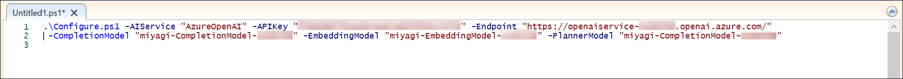


2. Finally, run Chat Copilot locally by executing the following command:
   
   ```
   .\Start.ps1
   ```
      >**Note:** This step starts both the backend API and the frontend application. It may take a few minutes for Yarn packages to install on the first run.

      >**Note:** In case of an error, follow the below steps.
      
3. Navigate to `chat-copilot > scripts > Start-Frontend.ps1` to run the yarn commands.

   

4. Navigate to `chat-copilot > scripts > Start-Backend.ps1` to run the dotnet commands.

   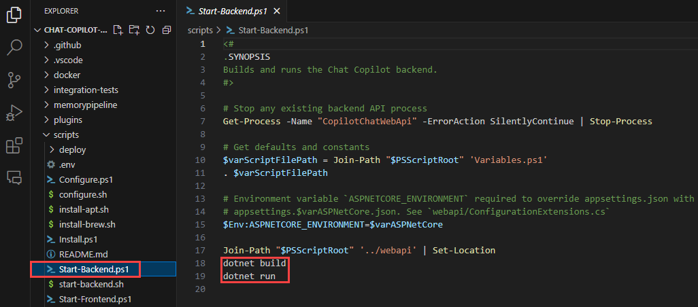

   >Note: Once done, navigate to the scripts directory and run the start command again.
   
5. You will get an output similar to this for the frontend:

   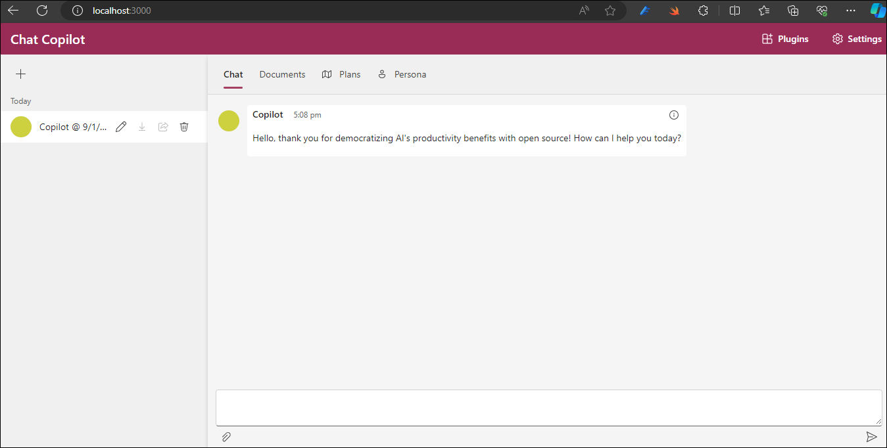

6. You will get an output similar to this for the backend:

   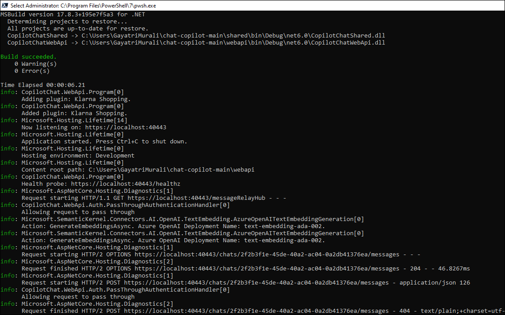

# Exercise 2: Chat with your own documents

## Task 1: Chat with your own documents in the Chat Copilot Application

1. Click on the **Documents** tab at the top and click on **Upload**.

1. Navigate to C:\Labfiles\Documents to upload the 3 pdfs.

   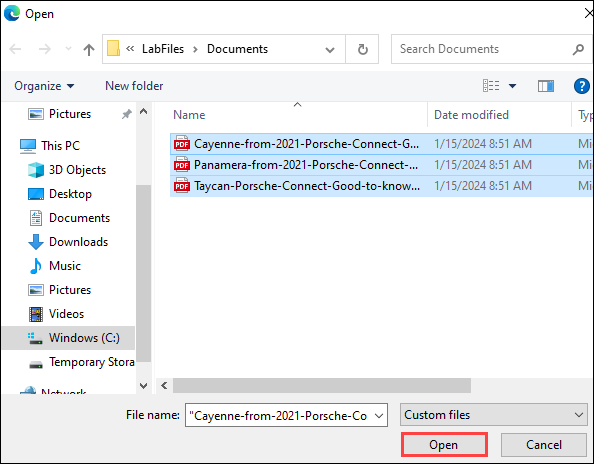

1. Once it is uploaded, provide the below prompt and check how the response is generated by Copilot.

   ```
   How to operate Android Auto in Porche Taycan? Give step-by-step instructions.
   ```
   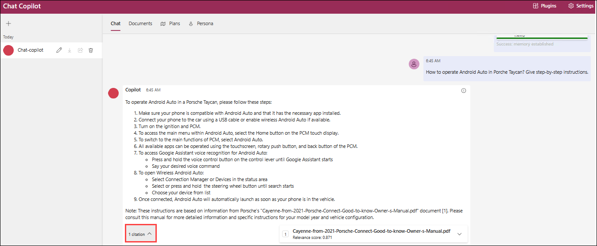
   
1. Provide another prompt and check how the response is generated by Copilot.

   ```
   Give detailed information on Apple CarPlay.
   ```
   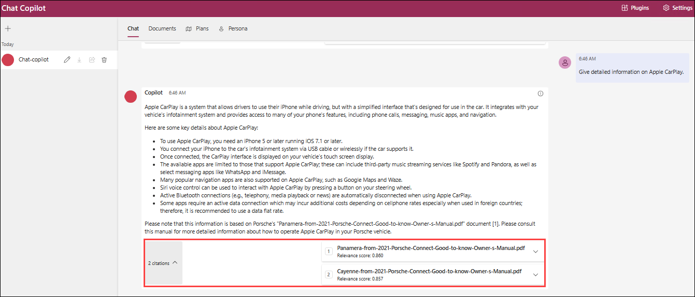
   
1. The response not only answered the question based on the content found in these documents, but it also included citations (1) to that content to validate the accuracy of the information. When you click on an annotation, the app jumps right to the page of the document (2) that goes into the comparison of the plans, so that we can read more or do additional validation on the accuracy of the answer under the citation section.

1. Click on the **Edit** button on the left to rename.

1. Click on the **Add** button to create a **New Session**.
