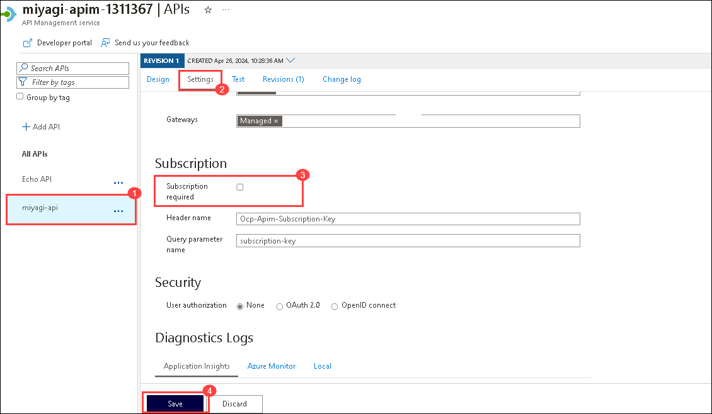

## Lab 2.2: Explore and Verify the Containerized Recommendation service in Azure Container Apps using Local Miyagi UI.
 
### Task 1: Update Container App Recommendation service URL for Miyagi UI

1. In the Azure Portal page, in the Search resources, services, and docs (G+/) box at the top of the portal, enter **Container Apps (1)**, and then select **Container Apps (2)** under services.

   

1. In the **Container Apps** blade, select **ca-miyagi-rec-<inject key="DeploymentID" enableCopy="false"/>**.

   

1. In the **ca-miyagi-rec-<inject key="DeploymentID" enableCopy="false"/>** page, from left navigation pane select **Ingress** **(1)** under setting session and copy **Endpoints** **(2)** URL link.

   

1. Navigate back to **Visual Studio Code**, navigate to **miyagi>ui>typescript>.env.** and replace existing code for **NEXT_PUBLIC_RECCOMMENDATION_SERVICE_URL** with copied for **Endpoints** and save the file 

   

### Task 2: Access Recommendation Service running on Azure Container Apps from Local Miyagi-UI 

1. Open a new terminal: by navigating  **miyagi/ui** and right-click on **ui/typescript** , in cascading menu select **Open in intergate Terminal**.

   

1. Run the following command to install the dependencies
   
    ```
    yarn dev
    ```

   **Note**: Let the command run, meanwhile you can proceed with the next step.

1. Open another tab in Edge, and  browse the following

   ```
   http://localhost:4001
   ```

   **Note**: Refresh the page continuously until you get miyagi app running locally as depicted in the image below.
                       
   

1. In the to the **recommendation service** ui page, and click on **personalize** button.

    

1. In the **personalize** page, select your **financial advisor** from the drop-down, and click on **Personalize**.

     

1. You should see the recommendations from the recommendation service in the Top Stocks widget.

       

1. Navigate back to the **ca-miyagi-rec-<inject key="DeploymentID" enableCopy="false"/>** Container App, from the left-side menu select **Log stream** under Monitoring, and you can go through the logs.
