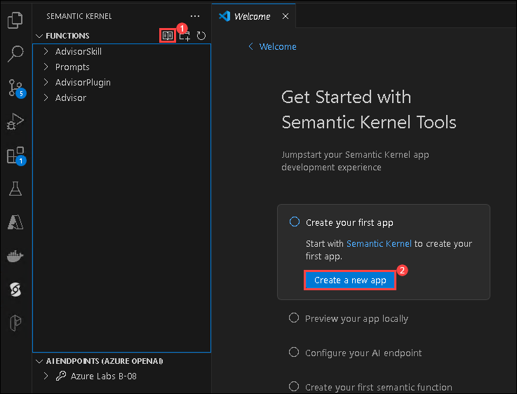

# Comenzando con Su Propio Copiloto

### Duración: 30 minutos

Semantic Kernel es un SDK que integra Modelos de Lenguajes Grandes (LLMs) como OpenAI, Azure OpenAI y Hugging Face con lenguajes de programación convencionales como C#, Python y Java. Semantic Kernel logra esto permitiéndole definir plugins que se pueden encadenar en solo unas pocas líneas de código.

Sin embargo, lo que hace a Semantic Kernel _especial_ es su capacidad para orquestar _automáticamente_ plugins con IA. Con los [planners](https://learn.microsoft.com/en-us/semantic-kernel/ai-orchestration/planner) de Semantic Kernel, puede solicitarle a un LLM que genere un plan que logre el objetivo único del usuario. Posteriormente, Semantic Kernel ejecutará el plan por el usuario.

### Tarea 1: Configurar y Ejecutar el Ejemplo de Semantic Kernel

1. Abra **Visual Studio Code** desde el escritorio de Lab VM haciendo doble clic en el acceso directo.

   

2. En **Visual Studio Code** en el panel izquierdo seleccione la extensión **Semantic Kernel** **(1)**, expanda haciendo clic en **AI ENDPONTS(OPEN AI)** **(2)**, haga clic en **Cambiar Proveedor de Punto de Conexión** **(3)**, y elija **AzureOpenAI** **(4)**.

   

3. En **AI ENDPONTS(AZURE OPENAI)**, haga clic en **Iniciar sesión en Azure** **(1)**, en la ventana emergente **La extensión 'Semantic Kernel Tools' quiere iniciar sesión con Microsoft** haga clic en **Permitir** **(2)**.

   

4. Esto lo redireccionará a **la página de inicio de sesión de Microsoft**, seleccione su cuenta de Azure **<inject key="AzureAdUserEmail"></inject>**, y regrese de vuelta a **Visual Studio Code**.

   

5. De vuelta en **Visual Studio Code** en el **Panel Functions**, haga clic en el **ícono Comenzar** **(1)** y siga el asistente para **crear su aplicación** **(2)** con la función semántica y guárdela.

   

6. Elija **C# Home Automation**

    

7. Navegue a la ubicación **C:\LabFiles** y **seleccione la ubicación para la nueva aplicación**

   .png)

8. Haga clic en **Sí, confío en los autores**.

   

9. Navegue al archivo **appsettings.json** **(1)** y reemplace el **script** **(2)** existente con lo siguiente:

   ```
   {
   "AzureOpenAI": {
     "ChatDeploymentName": "",
     "Endpoint": "",
     "ApiKey": ""
      }
   }
   ```

   

10. En ASP.NET Core, `appsettings.json` es un archivo de configuración que se utiliza para almacenar varias configuraciones de aplicación, como puntos de conexión de servicio y otras configuraciones específicas de la aplicación. Guarde el archivo presionando **Ctrl + S**. 

    | **Variables**       | **Valores**                                             |
    | --------------------|--------------------------------------------------------|
    | ChatDeploymentName  | **<inject key="CompletionModel" enableCopy="true"/>**  |
    | Endpoint            | **<inject key="OpenAIEndpoint" enableCopy="true"/>**   |
    | ApiKey              | **<inject key="OpenAIKey" enableCopy="true"/>**        |

11. Asegúrese de que su archivo `appsettings.json` se vea como se muestra en la siguiente captura de pantalla.

    

12. Configure un punto de conexión de Azure OpenAI abriendo una nueva **Terminal**. Haga clic en **(...) (1)** al lado del menú **Ver** y seleccione **Terminal(2)** > **Nueva Terminal(3)**.

    

13. Ejecute los siguientes comandos para instalar los paquetes necesarios.
    
    ```
    dotnet add package Microsoft.Extensions.Hosting --version 9.0.0-preview.3.24172.9
    dotnet add package Microsoft.Extensions.Options.DataAnnotations --version 9.0.0-preview.3.24172.9
    dotnet add package Microsoft.SemanticKernel --version 1.11.0
    ```

14. Para compilar y ejecutar la aplicación Home Automation desde la terminal, utilice los siguientes comandos: 

    ```powershell
    dotnet build
    dotnet run
    ```
    
    

    > **Nota**: Por favor ignore la advertencia.
    
15. Después de ejecutar `dotnet run`, puede hacer algunas preguntas y revisar la respuesta. Por ejemplo:: `What time is it?`

    

16. Ejemplo 2: `Set an alarm for 6:00 am.`

    

17. Si desea incluir preguntas adicionales, navegue hasta el archivo **worker.cs** e inserte sus nuevas preguntas en la **línea número 32**.

    

18. Alternativamente, puede plantear cualquier pregunta en la terminal.

### Tarea 2: Configurar Azure Cognitive Search

1. Vuelva a la pestaña **Portal de Azure**, busque y seleccione **AI Search**.

        

1. En la pestaña **Azure AI services | AI Search**, seleccione **acs-<inject key="DeploymentID" enableCopy="false"/>**.

   > **Nota**: Por favor haga clic en el botón Actualizar mientras ve el **Recuento de Documentos**.

1. En la pestaña Información general del servicio Search, haga clic en **Importar datos**.

        
   
1. En el menú desplegable, establezca el **Origen de Datos** en **Samples**, seleccione **CosmosDB hotels-sample**, y haga clic en **Siguiente : Agregar aptitudes cognitivas (opcional)**.

   
   
1. En **aptitudes cognitivas** deje todo con los valores predeterminados y haga clic en **Personalizar índice de destino**.

1. En **Personalizar índice de destino**, establezca el nombre del índice como **realestate-us-sample-index** y haga clic en **Siguiente:Crear un indizador**.

   

1. En **Crear un indizador**, cambie el nombre del indizador a **realestate-us-sample-indexer** y haga clic en **Enviar**.

   
    
1. Haga clic en **realestate-us-sample-index**, en la barra de búsqueda ingrese **Seattle** y haga clic en **Buscar**.

   

### Resumen

En esta práctica de laboratorio, aprendió a configurar y ejecutar el ejemplo de Semantic Kernel integrando el SDK en su proyecto, configurando proveedores de LLM, definiendo plugins y ejecutando el código. Además, adquirió conocimientos sobre la configuración de Azure Cognitive Search, incluyendo la creación o selección de un índice, la configuración de campos, la configuración de Semantic Kernel para interactuar con Azure, la definición de plugins y la prueba de la integración para capacidades de búsqueda mejoradas.
