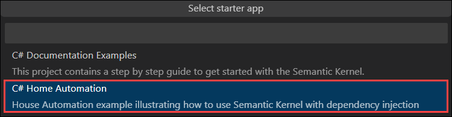
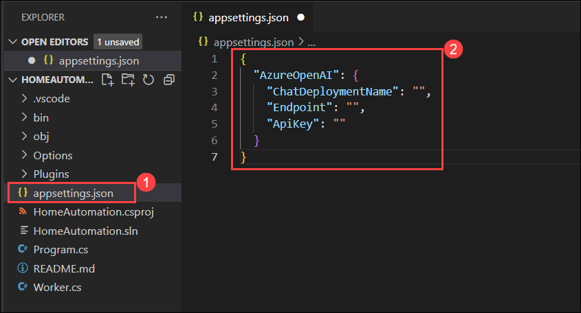
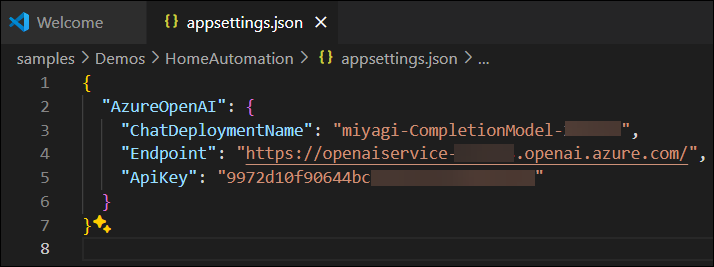
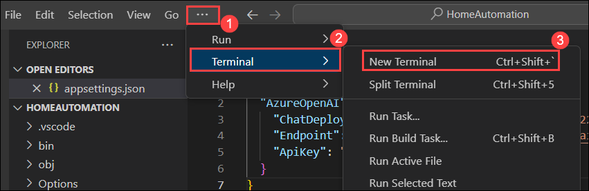
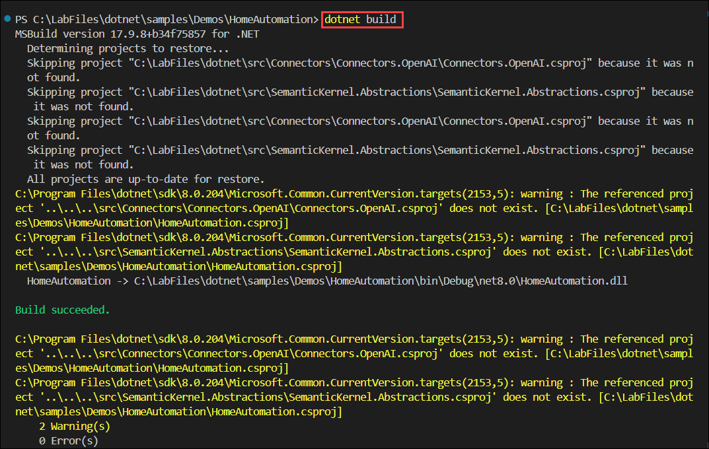
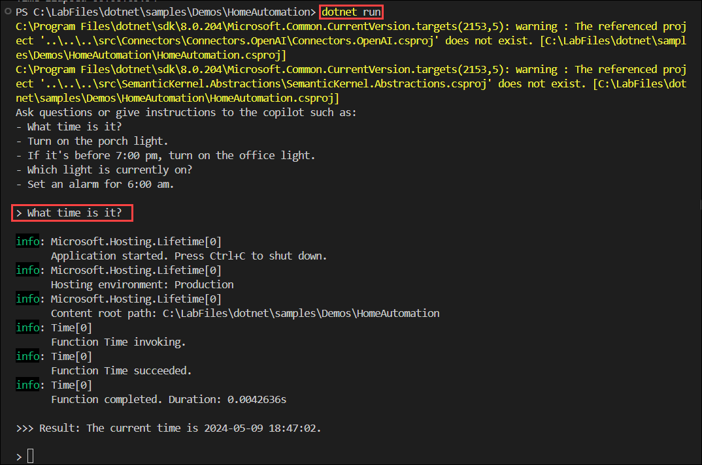
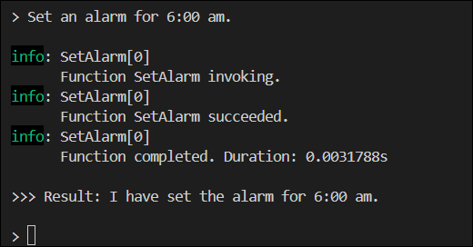
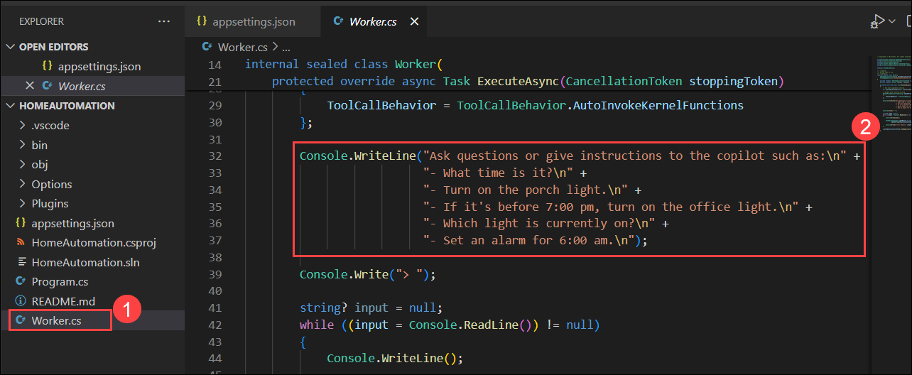

# Getting Started with Your Own Copilot

### Duration: 30 minutes

Semantic Kernel is an SDK that integrates Large Language Models (LLMs) like OpenAI, Azure OpenAI, and Hugging Face with conventional programming languages like C#, Python, and Java. Semantic Kernel achieves this by allowing you to define plugins that can be chained together in just a few lines of code.

What makes Semantic Kernel _special_, however, is its ability to _automatically_ orchestrate plugins with AI. With Semantic Kernel
[planners](https://learn.microsoft.com/en-us/semantic-kernel/ai-orchestration/planner), you can ask an LLM to generate a plan that achieves a user's unique goal. Afterwards, Semantic Kernel will execute the plan for the user.

### Task 1: Configure and Run the Semantic Kernel Sample

1. Open **Visual Studio Code** from the Lab VM desktop by double-clicking on it.

   

2. In the **Visual Studio Code** from the left panel select **Semantic Kernel** **(1)** plugin, expand  by click on **AIENDPONTS(OPEN AI)** **(2)**, click on **Switch EndPoint Provider** **(3)**, and select **AzureOpenAI** **(4)**.

   

3. Under **AI ENDPONTS(AZURE OPENAI)**, click on **sign in to Azure** **(1)**, in the pop-up  **The extension 'Semantic Kernel Tools' wants to sign in using Microsoft** click on **Allow** **(2)**.

   

4. This will redirect to **Microsoft login page**, select your Azure account **<inject key="AzureAdUserEmail"></inject>**, and navigate back to the **Visual studio code**.

   

5. Navigate back to the **Visual Studio Code** From the **Functions panel**, click on the **Get started icon** and follow the wizard to **create your app** with the semantic function and save it

   

6. Choose **C# Home Automation**

    

7. Browse the location **C:\LabFiles** and **select location for new app**

   .png)

8. Click on **Yes, I trust authors**.

   

9. Navigate to the **appsettings.json** **(1)** file and replace the existing **script** **(2)** with the following:

   ```
   {
   "AzureOpenAI": {
     "ChatDeploymentName": "",
     "Endpoint": "",
     "ApiKey": ""
      }
   }
   ```

   

10. In ASP.NET Core, `appsettings.json` is a configuration file used to store various application settings, such as service endpoints, and other application-specific settings and save the file **Ctrl + S**. 

    | **Variables**       | **Values**                                             |
    | --------------------|--------------------------------------------------------|
    | ChatDeploymentName  | **<inject key="CompletionModel" enableCopy="true"/>**  |
    | Endpoint            | **<inject key="OpenAIEndpoint" enableCopy="true"/>**   |
    | ApiKey              | **<inject key="OpenAIKey" enableCopy="true"/>**        |

11. Make sure that your `appsettings.json` file looks as shown in the below screenshot.

    

12. Configure an Azure OpenAI endpoint by Opening a New **Terminal** click on **(...) (1)** next to **View** menu and select **Terminal(2)** > **New Terminal(3)**.

    

13. Execute the following commands to install the necessary packages.
    
    ```
    dotnet add package Microsoft.Extensions.Hosting --version 9.0.0-preview.3.24172.9
    dotnet add package Microsoft.Extensions.Options.DataAnnotations --version 9.0.0-preview.3.24172.9
    dotnet add package Microsoft.SemanticKernel --version 1.11.0
    ```

14. To build and run the Home Automation application from the terminal use the following commands:

    ```powershell
    dotnet build
    dotnet run
    ```
    
    

    > **Note**: Please disregard the warning.
    
15. After running `dotnet run`, you can ask few questions and review the response. For example: `What time is it?`

    

16. Example 2: `Set an alarm for 6:00 am.`

    

17. If you wish to include additional questions, navigate to the **worker.cs** file and insert your new questions at **line number 32**.

    

18. Alternatively, you can pose any question to in the terminal.

### Task 2: Configure Azure Cognitive Search

1. Navigate back to the **Azure portal** tab, search and select **AI Search**.

        

1. In **Azure AI services | AI Search** tab, select **acs-<inject key="DeploymentID" enableCopy="false"/>**.

   > **Note**: Please click on the refresh button still you view the **Document Count**.

1. In the overiew tab of search service, click on the **Import data**.

        
   
1. From the drop-down select **Data Source** as **Sample**, select the **CosmosDB hotels-sample**, and click on **Next : Add cognitive skills(optional)**.

   
   
1. In **cognitive skills** leave as default and click on **Customize target index**.

1. In the **Customize target index**, Enter the index name as **realestate-us-sample-index** and click on **Next:Create an indexer**.

   

1. In the **create an indexer**, change the indexer name as **realestate-us-sample-indexer** and click on **submit**.

   
    
1. Click on **realestate-us-sample-index** in the search bar enter **Seattle** and click on **Search**.

   

### Summary

In this lab, you learned how to configure and run the Semantic Kernel sample by integrating the SDK into your project, setting up LLM providers, defining plugins, and executing the code. Additionally, you gained knowledge on configuring Azure Cognitive Search, including creating or selecting an index, setting up fields, configuring Semantic Kernel to interact with Azure, defining plugins, and testing the integration for enhanced search capabilities.
